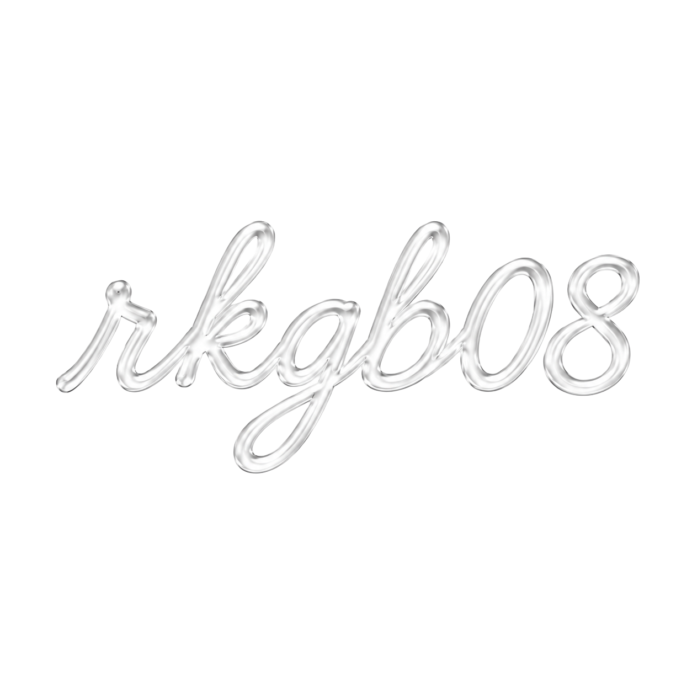
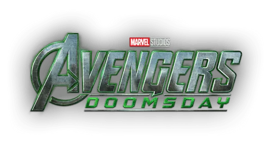

# rkgb08 - Next Generation AI Glasses

<a href="https://rkgb08.github.io/coming-soon-/" target="blank">https://rkgb08.github.io/coming-soon-/</a>

<h3 align="right">Connect with me:</h3>

> **"A smarter way to experience the future."**

Welcome to the official repository for **rkgb08**. We are developing the next generation of AI Glasses designed to seamlessly blend intelligent technology into your daily life.

---

## Overview

**rkgb08** is built around creating an intuitive, modern human-AI interaction standard using smart eyewear. 

* **Teaser Release:** Launching before *Avengers: Doomsday*!
* **Mission:** Bringing the future of AI technology directly to your line of sight.

---

## Preview & Media

Watch our official preview and promo video below:
<!--

-->

---

## Learn More

For complete product details, specifications, and architecture:
* 📄 Read our [Documentation / Whitepaper (PDF)](ksgb08.pdf)

---

## Connect & Socials

Stay updated and get in touch with us across our official channels:
<h3 align="left">Connect with me:</h3>

---

## License & Credits

© 2026 **rkgb08**. All rights reserved.  
*Designed and engineered by RKGB08.*
